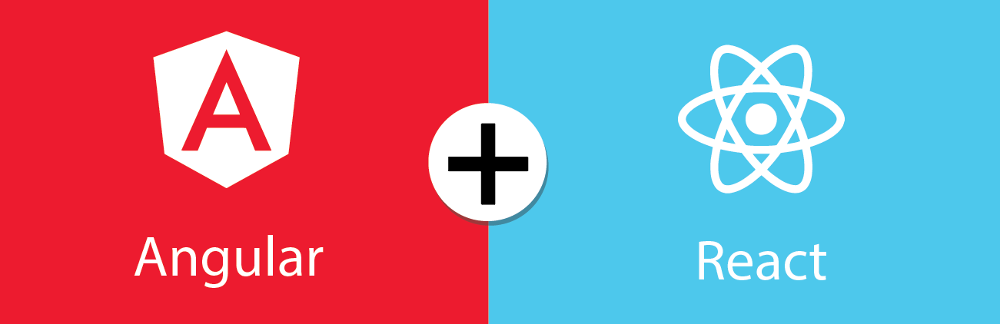

<p align="center">
  <a href="https://npmjs.org/package/ngx-react"></a>
  <a href="https://npmjs.org/package/ngx-react"></a>
</p>

<p align="center">
  
</p>

 <h3 align="center">ngx-react allows you to seamlessy use ⚛️ React and  🅰️ Angular components together.</h3>

<p align="center">
   👉 This package will be the a perfect match to migrate from Angular to React.
</p>

<p align="center">
⭐ this repo if you like this package, it helps to motivate me :)
</p>

# 🧑‍💻 Sample

Jump to the [sample](https://github.com/oguimbal/ngx-react-sample) repository for a a working sample ([here](https://stackblitz.com/github/oguimbal/ngx-react-sample) on Stackblitz)

# 📐 Setup

## 1) Prepare your Angular project

### A) Install ngx-react:

```
npm i ngx-react
```

### B) Install React:

```
npm i react react-dom -S
npm i @types/react @types/react-dom -D
```

### C) Configure typescript so it picks up TSX:

```json
      "jsx": "react-jsx",
```

(in your tsconfig.json, under the `"compilerOptions"` section)

### D) Add the `node_modules/ngx-react/src/*` as included in your `tsconfig.json` compilation:

```json

  "include": [
    "src",  // you should already have this one if you had an "include" section :)
    "node_modules/ngx-react/src/*" // 👈  add this
    // [...]
  ],
```

**(NB: If someone has a better solution that this, please tell me... but pre-compilling & publish the source seems to fail the angular build when installing this lib)**

## 2) Declare your bridge

At the root of you project, declare a file `bridge.ts` :

```typescript
import { NgxReactBridge } from "ngx-react";

// declare the bridge
export const reactBridge = new NgxReactBridge();
```

you can OPTINALLY declare there the directives that will be available in your react componetns globaly, such as, for instance:

```typescript
export const reactBridge = new NgxReactBridge();
    .addDirective('focus', (focus: boolean, _, elt) => setTimeout(() => focus && elt.focus()))
```

## 3) Enjoy

You can now use React & Angular together 🥳

# Use 🅰️ Angular components in ⚛️ React

Suppose you have an Angular component `MyAngularComponent` you would like to use in React.

In your component declaration file, just put:

```typescript
import { reactBridge } from "./bridge";

// [...] MyAngularComponent declaration

// this will be usable in React:
export const MyAngular = reactBridge.toReact(MyAngularComponent, {
  // declares that this component accepts children
  children: true,
});
```

Then, you'll be able to use this in react:

```typescript
import {MyAngular} from './my-angular.component';

// use the component, enjoy the types !
const Other = () => <MyAngular input={'whatever'}>;
```

# Use ⚛️ React components in 🅰️ Angular

Suppose you have a React component `MyReactComponent` you would like to use in Angular.

In your component declaration file, just put:

```typescript
import { reactBridge } from "./bridge";

function MyReactComponent(props: {
  data: string;
  dataChange: (evt: string) => void;
}) {
    // [...]
}

@Directive({ selector: "my-react-component" })
export class MyReactComponent_Angular extends reactBridge.toAngular(
  MyReactComponent
) {

  // a bit of extra work: You will have to map the properties yourself (type compatibility will be ensured by Tyepscript, though)
  @Input()
  data!: string;
  @Output()
  dataChange = new EventEmitter();
}
```

Then, declare `MyReactComponent_Angular` in your ng-module, and you'll be able to use your component in Angular :

```html
<my-react-component [(data)]="whatever"></my-react-component>
```


You can also use content projection of Angular in your React component, by using the `children` prop:

```tsx
function Thing(props: {
  children: React.ReactNode;
}) {
    // [...]
}

@Directive({ selector: "thing" })
export class ThingNg extends reactBridge.toAngular(Thing) {
}

// and use it like that in your angular template:
//  ⚠️ You will have to wrap content in an <ng-template>, though
<thing>
  <ng-template>
    <span> whatever </span>
  </ng-template>
</thing>
```


# Access 🅰️ Angular services from ⚛️ React

Easy

```typescript

function MyReactComp() {
  const service = useService(SomeAngularService); // simple, isnt it ?
}

```

# 🅰️ Angular outputs handling

Angular outputs are bound to callback props in react.

Meaning that:

```typescript
@Ouptut() valueChange: EventEmitter<string>;
```

Will be bound to a react prop:

```typescript
valueChange: (evt: string) => any;
```

# @Input / @Outputs 🅰️ vs ⚛️ React state hooks

When importing an Angular component in React, if your angular component has a matching `@Input()` and `@Output()` property pairs, say a `value` input, and `valueChange` output, you will notice that ngx-react will add a `value$` property (name of the input, with a `$` suffix) to the corresponding react type.

This property will be typed as something which is compatible with the `useState()` react hook. Meaning that, for if you have:

```typescript
@Input() value: string;
@Ouptut() valueChange: EventEmitter<string>;
```

Then you will be able to use your component in react like that:

```typescript
const value = useState("");

return <MyComonent value$={value} />;
```

... and the `value` state will be two-way bound with your react component !

(But of course, you can still use the `value: string` and `valueChange: (e: string) => any` props that ngx-react will have generated for you, if you prefer so)

# 💥 TODO / Limits

Currently not supported (todo):

- Integration with the Angular router
